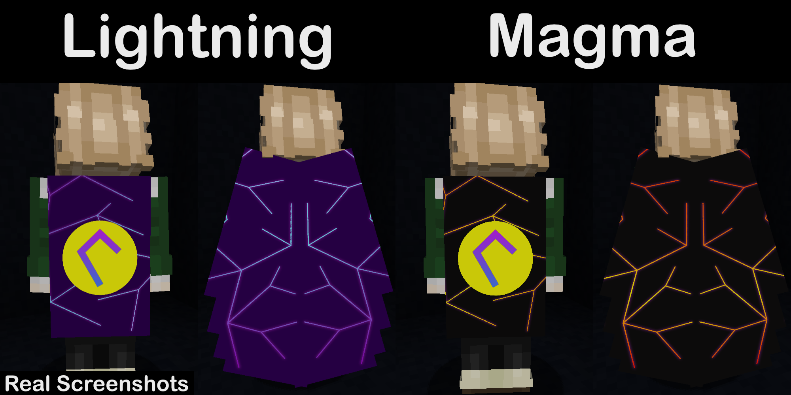

Fragment Utils
===========

Free and open source Factions mod for 1.19.2 made by stan. Join the [discord](http://fragmentmc.xyz)!

Features
-----

### Current

- Explosion Boxes
- Bread Crumbs
- Patch Crumbs
- HUD

### Planned

- Fullbright
- Auto Sign
- more

> Note: If you have more feature suggestions leave them in the [discord](http://fragmentmc.xyz).

Installing
-----

Download the [latest release](https://github.com/FragmentMC/FragmentUtils/releases/latest) and put it in your mods
folder.

### Requirements

- Minecraft 1.19.2
- [Fabric Mod Loader](https://fabricmc.net/use/installer/)
- [Fabric API](https://www.curseforge.com/minecraft/mc-mods/fabric-api)

> Note: If you want to join server that are not on version 1.19.2 I currently recommend using [ViaFabric](https://www.curseforge.com/minecraft/mc-mods/viafabric).

### Compatibility

The mod should be compatible with most other fabric mods. If you find any compatibility issues please open an issue on
github or make a ticket on the discord.

Support Me
-----

### Donations

If you have some spare money and like what I made, I would appreciate it if you left me a few bucks. I spent a hours on
end making this mod and it is important to me not to lock any features behind a paywall.

### Capes

Since I want to give something back to people who donate to me, and I want people to be able to show their support, if
you are a donor you are eligible to receive a cape visible to other Fragment Utils users. Note that the minimum donation
to be eligible is 5USD (at once) to prevent spam.

- Choose between "Lightning" and "Magma" cape
- Every FragmentUtils user can see your cape, even if you are not currently using the mod
- Capes include custom elytra texture

> Already Donated? Open a ticket in the [discord](http://fragmentmc.xyz) and you will get your cape as soon as possible.

Contributing
-----
Feel free to open pull requests with improvements, bug fixes or new features. Please only PR changes that you have
tested. Pull Requests can not always be accepted, but I will always try to provide a reason why it was not accepted for
what to change for it to be accepted.